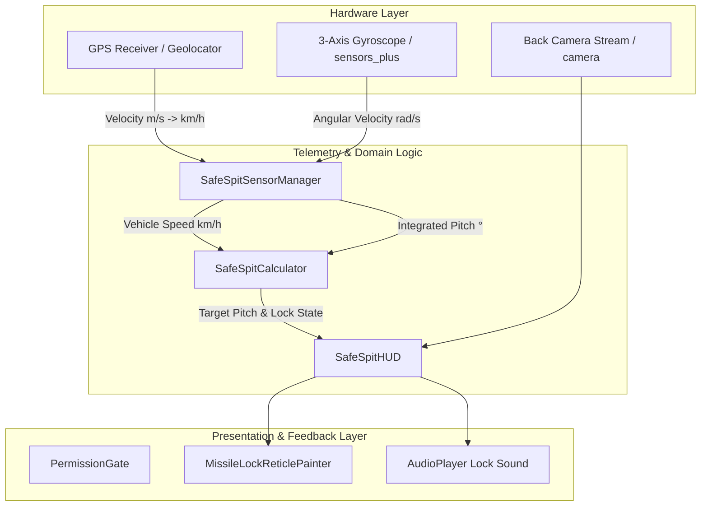

# SafeSpit: Tactical HUD Telemetry & Ballistics System
## Implementation Plan & Architectural Blueprint

> **Reconciliation note (2026-09-03).** This document is the older, prototype-aligned plan. It remains the authoritative source for the **proven formula and reticle geometry** (sections 2 and 4). For the complete implementation blueprint — layered architecture, normalized telemetry seam, vehicle/wind/Scoring/pass-and-play, Supabase, website, ESP32, Risk Register, and the exact 18-phase build order — see:
>
> - [`plan.md`](plan.md) — master product plan.
> - [`docs/IMPLEMENTATION_ORDER.md`](docs/IMPLEMENTATION_ORDER.md) — **the file Antigravity (the implementation agent) must follow**. This older roadmap is preserved below for context, not as the active build order.
> - [`update.ai/IMPLEMENTATION_RULES.md`](update.ai/IMPLEMENTATION_RULES.md) — 20 non-negotiable rules.
> - [`update.ai/DECISIONS.md`](update.ai/DECISIONS.md) — D-1 through D-20 reconciliation log.
> - [`update.ai/CURRENT_STATUS.md`](update.ai/CURRENT_STATUS.md) — current snapshot of the project.
>
> **Key reconciliations applied to the original plan below:**
> - **D-1 — Demo Mode entry on the gate.** The `PermissionGate` from Phase 5 keeps its `SYSTEM LOCKED` screen as the *default* response, but **adds a clearly labeled "ENTER DEMO MODE" button** alongside it. Demo Mode is opt-in, never silent. See [docs/SENSOR_SPEC.md](docs/SENSOR_SPEC.md), [docs/DEMO_PLAN.md](docs/DEMO_PLAN.md), and the fallback table in [docs/SENSOR_SPEC.md](docs/SENSOR_SPEC.md).
> - **D-2 — Local lock-tone asset.** The `AudioPlayer` source is moved from a network URL to a bundled local asset under `app/assets/audio/lock_tone.mp3`. `INTERNET` is no longer load-bearing for the core loop. See [docs/TECH_STACK.md](docs/TECH_STACK.md) and [update.ai/DECISIONS.md](update.ai/DECISIONS.md).
> - **D-13 — Edge-triggered lock cue.** Phase 6's state-transition rule is preserved **and is now the only correct rule**: audio and haptic fire on the false→true edge and (optionally) the true→false edge — *not* continuously while locked. The `_wasClear` boolean pattern from the prototype is mandatory; level-triggered designs create an audio loop bug.
> - **Path corrections.** When the reference build actually scaffolds the project, the prototype's three root files are promoted into `app/lib/simulation/safe_spit_calculator.dart`, `app/lib/sensors/sensor_manager.dart`, and `app/lib/hud/missile_lock_reticle_painter.dart` (per the layered architecture in [docs/ARCHITECTURE.md](docs/ARCHITECTURE.md)). Their behavior is preserved byte-for-byte; only the path and the seams around them change.
> - **D-4, D-5, D-14.** Vehicle `Car` profile uses `turbulenceFactor=1.0, angleBias=0.0` so the proven test points still pass; wind does **not** affect the lock tolerance; speed is clamped to `>= 0` before the formula.
> - **D-7, D-9, D-10.** ESP32 is invisible to the Android app; every backend call goes through a `BackendGateway` interface (default `NoopBackendGateway`); all HUD animation stays inside the existing `CustomPainter.shouldRepaint` pattern — no Rive/Lottie.
>
> This document does **not** get rewritten in place. The cross-references above are the canonical source of truth. The body below is the historical prototype-aligned plan, kept intact for evidence and continuity.

---

## 1. System Overview & Objective
**SafeSpit** is a real-time Fighter Jet Heads-Up Display (HUD) mobile application. Its primary objective is to calculate aerodynamic departure angles for projectiles ejected from moving vehicles, preventing fluid blowback, boundary-layer eddy recirculation, and vehicle exterior pane contamination through:
- Live GPS telemetry speed tracking.
- Gyroscope numerical angular velocity integration.
- Camera passthrough with tactical green military HUD styling.
- Missile lock-on reticle graphics and acoustic alerts.

---

## 2. Mathematical & Telemetry Models

### A. Dynamic Departure Pitch Formula
At static rest ($0\text{ km/h}$), an initial parabolic launch angle of $45.0^\circ$ is used. As vehicle velocity ($v$) increases, horizontal wind shear requires increasing the rearward pitch by $1.2^\circ$ for every $5.0\text{ km/h}$ increment, capped at $85.0^\circ$:

$$\theta_{\text{target}}(v) = \text{clamp}\left(45.0^\circ + \left(\frac{v}{5.0}\right) \times 1.2^\circ,\ 45.0^\circ,\ 85.0^\circ\right)$$

### B. Launch Window Clearance & Tolerance
A firing solution is considered **Locked / Clear to Eject** when the device's real-time pitch ($\theta_{\text{actual}}$) is within a $\pm 5.0^\circ$ tolerance window:

$$\Delta\theta = |\theta_{\text{actual}} - \theta_{\text{target}}|$$
$$\text{IsClearToEject} = (\Delta\theta \le 5.0^\circ)$$

### C. Gyroscopic Pitch Numerical Integration
Angular velocity along the device Y-axis ($\omega_y\text{ in rad/s}$) is sampled across time intervals $\Delta t$:

$$\theta_{\text{actual}}(t) = \text{clamp}\left(\theta_{\text{actual}}(t - \Delta t) + \left(\omega_y \times \frac{180^\circ}{\pi} \times \Delta t\right),\ 0.0^\circ,\ 180.0^\circ\right)$$

---

## 3. Phased Implementation Roadmap

### Phase 1: Dependency Setup & Native Permissions
1. **Package Configuration**: Configure `pubspec.yaml` with hardware and UI dependencies:
   - `camera`: Live camera passthrough
   - `geolocator`: High-accuracy navigation positioning
   - `sensors_plus`: Gyroscope stream tracking
   - `audioplayers`: Acoustic missile lock alerts
   - `permission_handler`: Runtime system permissions
2. **Platform Manifests**: Add `ACCESS_FINE_LOCATION`, `ACCESS_COARSE_LOCATION`, and `CAMERA` permissions in `AndroidManifest.xml`.

---

### Phase 2: Pure Domain Logic (`lib/safe_spit_calculator.dart`)
1. Implement `SafeSpitCalculator` with zero UI framework dependencies for deterministic logic and testability.
2. Provide `calculateTargetPitch()` to compute the optimal departure pitch.
3. Provide `isClearToEject(double currentPitch)` returning boolean launch clearance.

---

### Phase 3: Telemetry Fusion (`lib/safe_spit_sensor_manager.dart`)
1. Implement `SafeSpitSensorManager` as a builder-pattern stateful widget.
2. Initialize `Geolocator.getPositionStream` with `LocationAccuracy.bestForNavigation` and speed conversion ($v_{\text{km/h}} = v_{\text{m/s}} \times 3.6$).
3. Initialize `gyroscopeEventStream()` with delta-time calculations to integrate pitch angle.
4. Auto-recalculate safety thresholds on incoming sensor events and pass updated state to the presentation tree.

---

### Phase 4: Reticle Graphics & Tactical HUD Canvas (`lib/main.dart`)
1. **Targeting Painter**: Build `MissileLockReticlePainter` using Flutter's `CustomPainter`:
   - Inner center reticle ring ($\varnothing 70\text{px}$) with center targeting pip.
   - 4-corner bracket framing ($\pm 70\text{px}$ offset).
   - Cardinal crosshair lines ($45\text{px}$ to $90\text{px}$).
   - Secondary concentric outer lock ring ($\varnothing 190\text{px}$) rendered upon target acquisition.
2. **Color Dynamics**:
   - Target Locked / Clear: `#39FF14` (Tactical Neon Green)
   - Danger / Blowback Risk: `#FF073A` (Alert Neon Red)

---

### Phase 5: Hardware Access Gate & Camera Passthrough
1. **Permission Gate**: Create `PermissionGate` displaying a military-styled `SYSTEM LOCKED` screen until camera and high-accuracy GPS permissions are granted.
2. **Camera Layer**: In `SafeSpitHUD`, initialize `CameraController` (`ResolutionPreset.high`) with a 5% translucent green tactical filter overlay.
3. **Top Diagnostics Bar**: Display system version, target pitch tracking, and actual pitch angle.
4. **Bottom Telemetry Bar**: Render live velocity readouts (`KM/H`) and lock status indicators.

---

### Phase 6: Acoustic Missile-Lock Feedback System
1. Implement state transition detection in the UI stream builder:
   - When `isClear` transitions from `false` to `true`, trigger acoustic tone.
2. Play lock-on tone using `AudioPlayer`.

---

## 4. Verification & Testing Matrix

| Component | Target Behavior | Verification Method |
| :--- | :--- | :--- |
| **Physics Model** | $0\text{ km/h} \to 45^\circ$; $50\text{ km/h} \to 57^\circ$; $200\text{ km/h} \to 85^\circ$ clamp | Unit test `SafeSpitCalculator` |
| **Tolerance Logic** | Pitch within $\pm 5^\circ$ yields `isClear = true` | Unit test boundary values ($\pm 4.9^\circ$ vs $\pm 5.1^\circ$) |
| **Sensor Fusion** | Gyro integration updates pitch cleanly without negative/overflow bounds | Hardware bench testing / tilt simulation |
| **Acoustics** | Sound triggers once upon entering lock window (no duplicate loop) | State-transition verification |
| **Hardware Fallback** | Camera or GPS denial prompts diagnostic lock screen | Permission revocation in OS settings |
