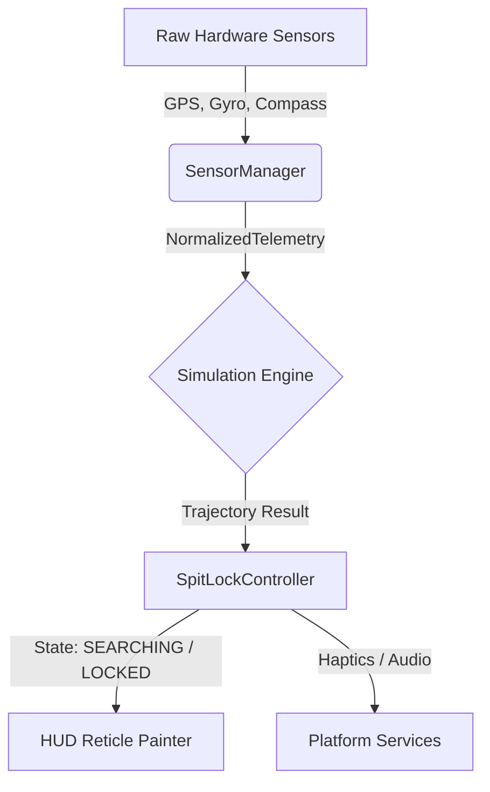

<div align="center">
  
  <h1>SAFE//SPIT</h1>
  <p><strong>Tactical Aerospace Instrumentation for Automotive Expectorations.</strong></p>

  <p>
    <a href="#features">Features</a> • 
    <a href="#architecture">Architecture</a> • 
    <a href="#installation">Installation</a> • 
    <a href="#documentation">Documentation</a>
  </p>
</div>

---

> *"The engineering under the joke is not a joke."*

SAFE//SPIT is a deliberately, absurdly over-engineered tactical instrumentation system designed to calculate the optimal angle for spitting out of a moving vehicle. 

It presents a fictional, proprietary ballistics heuristic through a fighter-jet HUD aesthetic, driven by real-time hardware telemetry (GPS speed, gyroscope pitch, compass heading), complete with a lock-on mechanism and haptic feedback.

The comedy comes entirely from the mismatch between the seriousness of the presentation and the triviality of the task. The physics might be hand-waved, but the software engineering is strictly mission-critical.

## 🎯 Features

- **Tactical AR HUD:** A high-performance, custom-painted Flutter overlay acting as a live targeting reticle.
- **Hardware Telemetry Integration:** Fuses raw GPS velocity, gyroscope pitch, and compass heading into a normalized data stream.
- **Deterministic Ballistic Simulation:** Calculates wind blowback, vehicle trajectory, and human spit vectors in real-time.
- **Spit Lock Protocol:** The HUD seamlessly transitions from `SEARCHING` to `LOCKING` to `LOCKED` when the user hits the optimal ejection angle, providing visual, haptic, and audio feedback.
- **Demo Mode:** A robust fallback mode generating synthetic telemetry for indoor demonstrations and pitch testing.
- **Right/Left Seat Support:** Mirrors targeting systems depending on if the user is sitting in the driver (Right in India) or passenger (Left in India) seat.
- **Reverse Sitting Dynamics:** Dynamic trajectory relaxation if the user is facing backwards relative to vehicular movement.

## 🧠 Architecture

SAFE//SPIT employs a strict, decoupled architecture separating raw sensor inputs, determinist physics simulations, and the presentation layer.



### The Seam
The system is built around a single, powerful abstraction: `NormalizedTelemetry`. The UI and Simulation engines *never* talk directly to the hardware. They consume a clean, deterministic stream of telemetry. This allows for our highly reliable **Demo Mode**, which seamlessly injects synthetic telemetry at the seam without the downstream systems knowing the difference.

## 🛠️ Installation & Setup

SAFE//SPIT is a Flutter application. You'll need the Flutter SDK and a connected physical device (GPS and Gyroscope required for live mode).

```bash
# Clone the repository
git clone https://github.com/your-username/safespit.git

# Enter the application directory
cd safespit/app

# Install dependencies
flutter pub get

# Run on a connected device
flutter run --release
```

## 📚 Extensive Documentation

We take documentation as seriously as we take aerodynamic fluid departure. Our repository contains an extensive suite of specifications, architectural decisions, and risk registries. 

- [`ARCHITECTURE.md`](docs/ARCHITECTURE.md): The structural foundation of the app.
- [`PRODUCT_SPEC.md`](docs/PRODUCT_SPEC.md): The core vision and user journey.
- [`RISK_REGISTER.md`](docs/RISK_REGISTER.md): Our brutally honest matrix of what can go wrong and how we mitigate it.
- [`SIMULATION_SPEC.md`](docs/SIMULATION_SPEC.md): How we model fluid dynamics against vehicular velocity.
- [`SENSOR_SPEC.md`](docs/SENSOR_SPEC.md): Hardware integration and telemetry normalization.

## 🏆 Project Philosophy

1. **The Joke is the Point:** Play it entirely straight. No winking at the camera.
2. **Zero Network Dependency:** The core loop works in a tunnel, in the desert, or anywhere else you might need to eject fluid.
3. **Flawless UI Thread:** The HUD repaints at 60fps. Sensor data is processed asynchronously.

---
<div align="center">
  <p>Built with 💚 and strict aerodynamic tolerances.</p>
</div>
