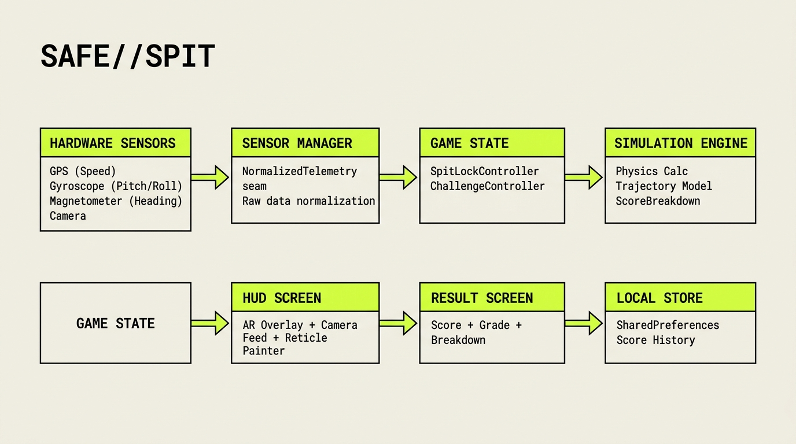

# SAFE//SPIT 🎯

## Basic Details
### Team Name: Minions

### Team Members
- Team Lead: Alsabith KA - College of Engineering Chengannur
- Member 2: Harsh C Hari - College of Engineering Chengannur

### Project Description
SAFE//SPIT is a deliberately over-engineered tactical aerospace instrumentation system for calculating the optimal angle to spit out of a moving vehicle. It fuses real hardware telemetry into a fighter-jet style targeting HUD.

### The Problem (that doesn't exist)
Expectorating from a moving vehicle is an inexact science fraught with fluid blowback, boundary-layer eddy recirculation, and catastrophic aerodynamic miscalculations. Thousands of theoretical drops of saliva are lost daily to the wind due to poor trajectory planning. 

### The Solution (that nobody asked for)
A highly tactical, hardware-driven aerospace HUD that uses your phone's real-time GPS velocity, compass heading, and gyroscope pitch to lock onto the perfect fluid ejection vector. When your phone aligns with the optimal aerodynamic angle, you receive a full "missile-lock" audio/visual/haptic confirmation.

## Technical Details
### Technologies/Components Used
For Software:
- **Languages used**: Dart
- **Frameworks used**: Flutter
- **Libraries used**: `sensors_plus` (for raw hardware telemetry), `geolocator` (for GPS speed), `audioplayers`, `haptic_feedback`.
- **Tools used**: Git, Gemini (for generating our sleek aerospace UI assets), Supabase (for backend leaderboard architecture).

### Implementation
For Software:
# Installation
```bash
# Clone the repository
git clone https://github.com/your-username/safespit.git

# Enter the application directory
cd safespit/app

# Install dependencies
flutter pub get
```

# Run
```bash
# Run on a connected physical device (required for GPS/Gyroscope)
flutter run --release
```

### Project Documentation
For Software:

# Screenshots (Add at least 3)

*The tactical AR HUD locking onto the optimal trajectory while moving.*


*Demo mode generating synthetic telemetry for indoor pitch testing.*


*Spit Olympics multiplayer leaderboard showcasing peak aerodynamic performances.*

# Diagrams

*Our decoupled architecture featuring the NormalizedTelemetry seam for seamless synthetic data injection.*

### Project Demo
# Video
[Add your demo video link here]
*A real-world test demonstrating the transition from SEARCHING to SPIT LOCK using live vehicular speed and pitch matching.*

# Additional Demos
[Add any extra demo materials/links]

## Team Contributions
- [Name 1]: Flutter HUD design, custom painter logic, and core UI mechanics.
- [Name 2]: Hardware telemetry integration, GPS speed mapping, and gyroscope normalization.
- [Name 3]: Deterministic ballistic physics modeling and Supabase integration.

---
Made with ❤️ at TinkerHub Useless Projects 


